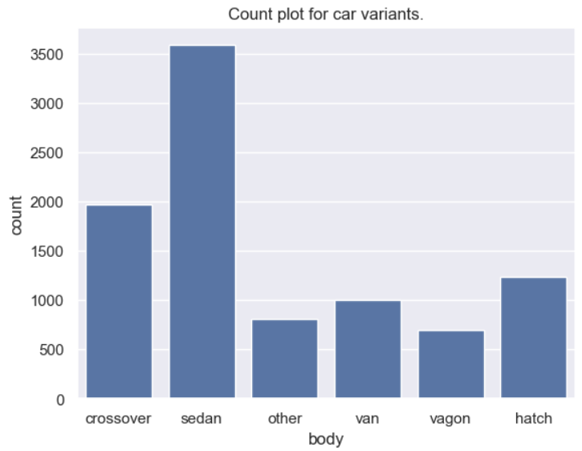
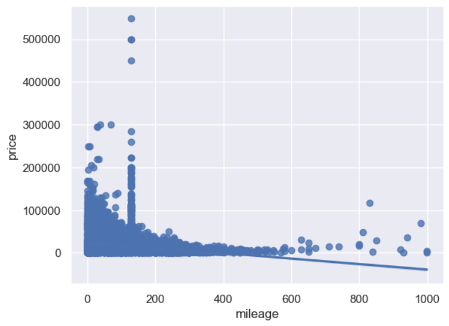
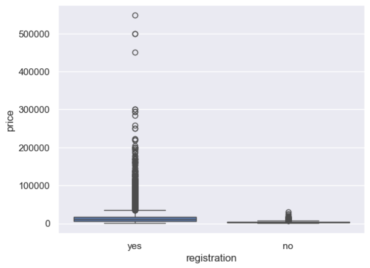
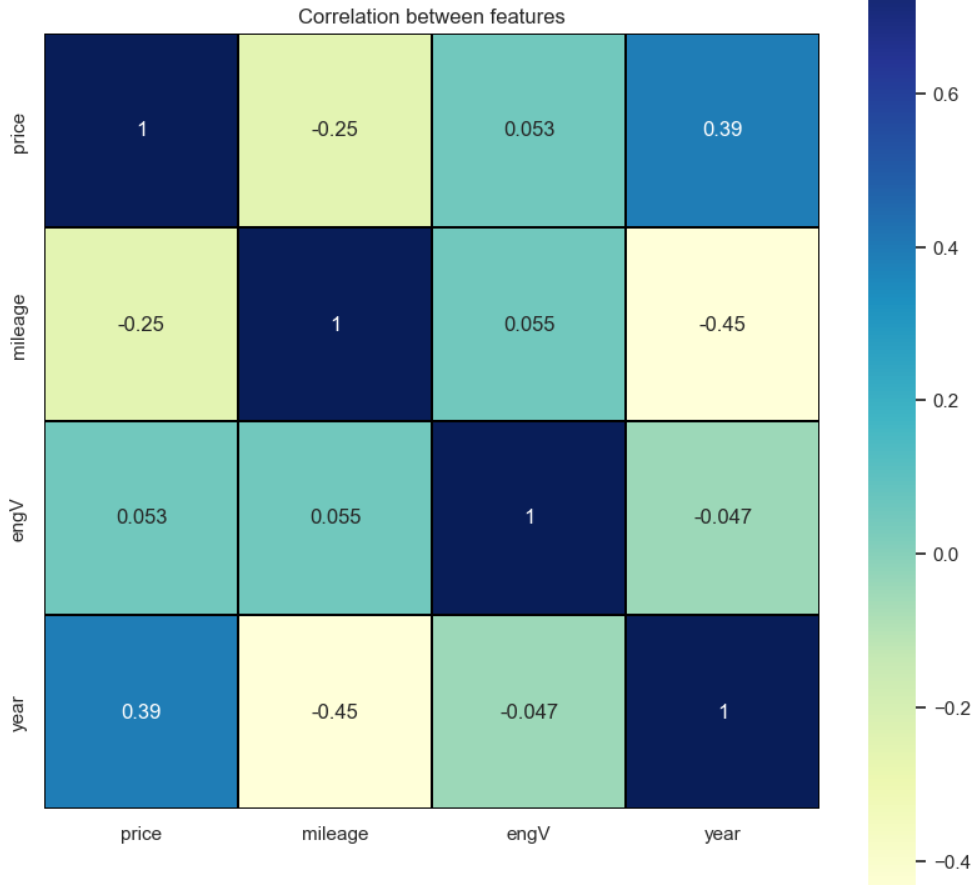

# 🚗 Car Price Analysis & Market Insights

**Exploratory Data Analysis of the Used Car Market**

---

# 📌 Project Overview

The used car market is influenced by multiple factors such as **vehicle mileage, engine specifications, brand reputation, and registration status**.

This project performs **Exploratory Data Analysis (EDA)** on a dataset of **9,500+ used cars** to understand:

* What factors influence car prices
* How mileage impacts resale value
* Which vehicle attributes correlate with higher prices
* How different features interact in the used car market

The analysis was performed using **Python, Pandas, and data visualization libraries** in a Jupyter Notebook environment.

---

# 🎯 Business Questions

This project attempts to answer the following analytical questions:

1. What is the **overall distribution of used car prices**?
2. Does **higher mileage significantly reduce vehicle price**?
3. Which features have the **strongest correlation with price**?
4. Are there **outliers or unusual patterns** in the dataset?
5. What insights can be derived about the **used car resale market**?

---

# 📊 Dataset Description

The dataset contains information about **used car listings** including technical specifications and pricing details.

### Key Features

| Column        | Description                              |
| ------------- | ---------------------------------------- |
| Brand         | Manufacturer of the vehicle              |
| Model         | Model name                               |
| Price         | Selling price of the car                 |
| Mileage       | Distance the car has travelled           |
| Engine Volume | Engine size                              |
| Engine Type   | Petrol / Diesel / Other                  |
| Registration  | Whether the car is officially registered |
| Year          | Manufacturing year                       |

Total records: **~9500 vehicles**

---

# 🛠️ Tools & Technologies

| Tool             | Purpose               |
| ---------------- | --------------------- |
| Python           | Programming language  |
| Pandas           | Data manipulation     |
| NumPy            | Numerical computation |
| Matplotlib       | Data visualization    |
| Seaborn          | Statistical plots     |
| Jupyter Notebook | Interactive analysis  |

---

# 🔎 Data Analysis Workflow

The analysis follows a structured **EDA pipeline**.

---

## 1️⃣ Data Loading

```python
import pandas as pd
import numpy as np
import matplotlib.pyplot as plt
import seaborn as sns

df = pd.read_csv("dataset.csv")
df.head()
```

This loads the dataset into a **Pandas DataFrame** for further analysis.

---

## 2️⃣ Data Exploration

Initial exploration helps understand dataset structure.

```python
df.info()
df.describe()
df.shape
```

This reveals:

* number of observations
* variable types
* statistical distribution of numerical features

---

## 3️⃣ Data Quality Checks

Checking for missing or inconsistent values.

```python
df.isnull().sum()
```

This step ensures the dataset is suitable for analysis.

---

## 4️⃣ Data Visualization

Visual analysis helps identify patterns and relationships.

### Price Distribution

```python
sns.histplot(df["price"], kde=True)
plt.title("Distribution of Car Prices")
plt.show()
```

This visualization shows how prices are distributed across vehicles.

---

### Feature Correlation

```python
corr = df.corr()

plt.figure(figsize=(10,8))
sns.heatmap(corr, annot=True, cmap="coolwarm")
plt.title("Feature Correlation Matrix")
plt.show()
```

This helps identify which variables influence pricing.

---

### Mileage vs Price

```python
sns.scatterplot(x="mileage", y="price", data=df)
plt.title("Price vs Mileage")
plt.show()
```

This chart highlights the relationship between **vehicle usage and resale value**.

---

# 📈 Key Insights

From the exploratory analysis:

### 📉 Mileage Impact

Cars with higher mileage generally have **lower resale value**, showing a negative relationship between mileage and price.

### 💰 Price Distribution

Vehicle prices are **right-skewed**, meaning most cars fall within a lower-to-mid price range while a few high-end vehicles increase the upper tail.

### 🔗 Feature Relationships

Some technical attributes such as **engine volume and vehicle characteristics** show moderate correlation with price.

### ⚠️ Outliers

A small number of vehicles have unusually high prices relative to their mileage, suggesting **luxury or premium vehicles**.

---

# 📊 Example Visualizations

### Most Popular Car Variants


### Correlation between Price and Mileage


### Price distribution between Registered and Non-Registered cars


### Correlation heatmap between all features


---

# 🚀 Future Improvements

This project can be extended with more advanced analytics:

* Feature engineering
* Outlier treatment
* Machine learning models for **car price prediction**
* Building an **interactive dashboard (Power BI / Tableau)**
